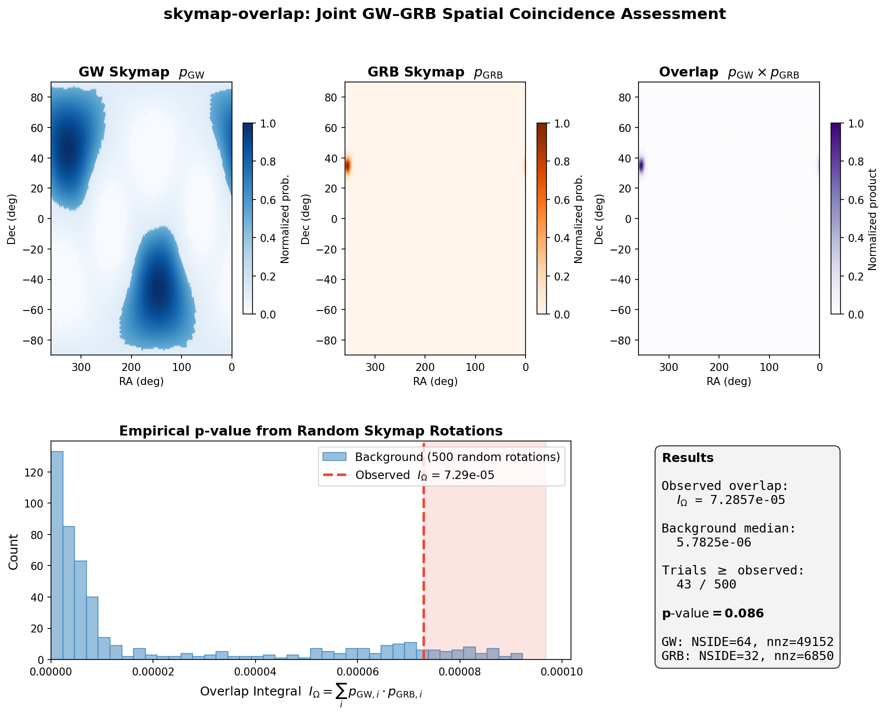

# Method

This page describes the statistical method implemented in **skymap-overlap**,
using random skymap rotation trials.

## Background: The RAVEN Method

When a gravitational wave (GW) event is detected in temporal coincidence with
a gamma-ray burst (GRB), the joint significance depends on both the temporal
and spatial coincidence.

The original RAVEN method (Urban et al. 2016) computes the joint FAR as:

$$
\text{FAR}_c = \text{FAR}_{\text{gw}} \times R_{\text{grb}} \times \Delta t \times \frac{1}{I_\Omega}
$$

where:

- $\text{FAR}_{\text{gw}}$ is the gravitational wave false alarm rate
- $R_{\text{grb}}$ is the GRB detection rate
- $\Delta t$ is the coincidence time window
- $I_\Omega = \sum_i p_{\text{gw}}(i) \times p_{\text{grb}}(i)$ is the skymap
  overlap integral

### Problem with RAVEN

Dividing by $I_\Omega$ assumes that the overlap integral follows a known
distribution. In practice, the distribution of $I_\Omega$ depends on the
specific skymap morphologies, and dividing by it does **not** yield a uniformly
distributed FAR. This leads to biased significance estimates, particularly
under-representing low-significance candidates.

## The Corrected Method

### Empirical P-value (Eq 4)

Instead of using $I_\Omega$ directly, we compute an empirical p-value:

1. Compute the observed overlap integral $I_\Omega^{\text{obs}}$ between the
   GW and GRB skymaps
2. Rotate the GRB skymap to $N$ uniformly random sky positions
3. At each position, compute the overlap with the GW skymap
4. The p-value is the fraction of trials where the overlap exceeds the
   observed value:

$$
p = \frac{1}{N} \sum_{i=1}^{N} \mathbf{1}\left[I_\Omega^{(i)} \geq I_\Omega^{\text{obs}}\right]
$$

This p-value is uniformly distributed under the null hypothesis (no spatial
coincidence), regardless of the skymap morphology.

### Joint FAR (Eq 3)

The corrected joint FAR combines the temporal FAR with the spatial p-value
using a log-remapping that ensures the result is uniformly distributed when
both inputs are uniform:

$$
\text{FAR}_c = \text{FAR}_{\text{gw}} \times R_{\text{grb}} \times \Delta t \times p \times \left[1 - \ln\left(\frac{\text{FAR}_{\text{gw}} \times p}{\text{FAR}_{\text{gw,max}}}\right)\right]
$$

where $\text{FAR}_{\text{gw,max}}$ is the maximum GW FAR considered by the
pipeline (e.g., 2/day).

The $1 - \ln(\cdot)$ term is derived from the product distribution of two
uniform random variables. Without it, the product $\text{FAR}_{\text{gw}} \times p$
would follow a non-uniform distribution (it would be biased toward smaller
values).

### Visualization

The figure below illustrates the full pipeline on a real GW+GRB skymap pair:

**Top row:** The GW skymap (LIGO BNS simulation, multi-lobed), the Fermi GBM
localization, and their pixel-by-pixel product — only the region where both
have significant probability contributes to the overlap integral.

**Bottom left:** The Monte Carlo background distribution. The GRB skymap is
rotated to 500 random sky positions and the overlap recomputed each time.
Most random placements yield near-zero overlap (the skymaps don't intersect),
but the observed overlap (red dashed line) sits in the tail — only 8.6% of
random trials exceed it.

## Implementation Details

### Sparse HEALPix Representation

Skymaps are stored as sparse arrays of `(pixel_index, probability)` pairs,
sorted by pixel index. This enables:

- **O(nnz) rotation**: Only non-zero pixels need to be transformed
- **O(nnz_a + nnz_b) overlap**: Merge-join on sorted indices instead of
  iterating over the full sky
- **Low memory**: A typical GRB skymap with ~1000 non-zero pixels at
  nside=256 uses ~16 KB instead of ~6 MB

### Rotation via Rodrigues' Formula

To rotate a skymap from its peak position to a random target position:

1. Convert source and target positions to Cartesian unit vectors
2. Compute the rotation axis (cross product) and angle (dot product)
3. Build a 3x3 rotation matrix using Rodrigues' formula
4. Apply the rotation to each non-zero pixel's center coordinates
5. Re-hash the rotated coordinates to HEALPix indices
6. Accumulate probabilities (multiple source pixels may land on the
   same target pixel)

### Resolution Matching

When two skymaps have different NSIDE parameters, the coarser map is
automatically upsampled by splitting each pixel into sub-pixels with
equal probability. This ensures the overlap integral is computed at the
finer resolution.

### Parallelism

The rotation trials are embarrassingly parallel. Each trial uses an
independent RNG stream (ChaCha8 seeded with `base_seed + trial_index`),
and the computation is distributed across all available CPU cores using
rayon.

## References

- Urban, A. L. et al. (2016). "First results of the RAVEN pipeline."
